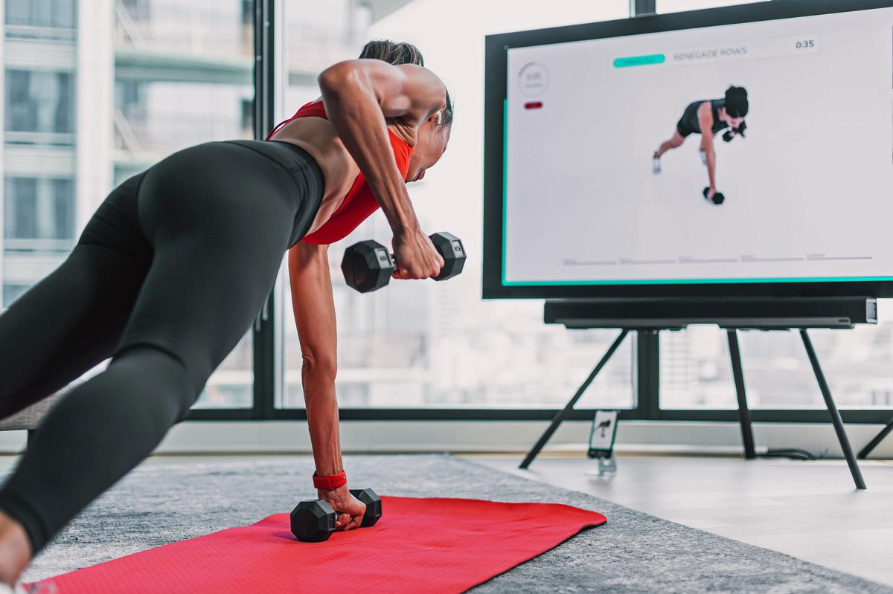

# AI-FitnessTrainer using YOLOv8-pose 🏋️

<p align="center">

</p>

In today's world, a healthy lifestyle is becoming increasingly relevant, and with it, interest in sports activities is growing. However, gaining experience and knowledge in this field can be a challenging task for many people. In this context, the application of artificial intelligence (AI) in the sports sector becomes a key element of successful training, analysis, and development of sports teams and individual athletes.

This repository provides a set of tools to help you improve your technique for the following exercises: **front squats, wide-arm push-ups, biceps push-ups, reverse push-ups**. This intelligent assistant analyzes your technique in real time, evaluates your posture using an AI model ([yolov8-pose](https://docs.ultralytics.com/ru/tasks/pose/)) and gives you feedback on your form.

A counter for correctly completed sets and so-called attempts to perform the exercise correctly has also been added. This will help you better understand your exercise statistics.

## How to use ✔️
1. Clone repository.
```
git clone https://github.com/KKopilka/AI-FinessTrainer.git
```
2. Install the requirements.
```
pip install -r requirements.txt
```
3. Run the script.
```
python manual.py <exercise_name>
```
4. It is possible to run the project with streamlit.
```
streamlit run app/live.py
```

## Project roadmap 📝

[X] Train a model for human pose estimation.

[X] Integration of the model into the project, processing of key points.

[X] Add exercises for major muscle groups.

[X] Add a counter for approaches and attempts.

[X] Run locally or through a browser (streamlit).


## Some ideas 📝
This project is not a fully finished version, so it can still be finalized.

Here are some ideas on how to improve this project are as follows:
- Add more exercises.
- Add more statistics to the program.
- Add a web/mobile app.